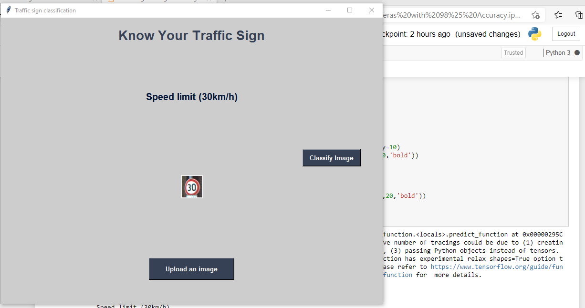

# Traffic Signs Recognition using CNN Keras

- Probelm Statement
- DataSets
- Model
- Traing accuracy
- Evalution on testing
- GUI App Using TkInter

## Problem Statement
In the world of Artificial Intelligence and advancement in technologies, many researchers and big companies like Tesla, Uber, Google, Mercedes-Benz, Toyota, Ford, Audi, etc are working on autonomous vehicles and self-driving cars. So, for achieving accuracy in this technology, the vehicles should be able to interpret traffic signs and make decisions accordingly.

---
## What is Traffic Signs Recognition?
There are several different types of traffic signs like speed limits, no entry, traffic signals, turn left or right, children crossing, no passing of heavy vehicles, etc. Traffic signs classification is the process of identifying which class a traffic sign belongs to

---
## Traffic Signs Recognition – About the Python Project
In this Python project example, we will build a deep neural network model that can classify traffic signs present in the image into different categories. With this model, we are able to read and understand traffic signs which are a very important task for all autonomous vehicles.

---
## The Dataset of Python Project
For this project, we are using the public dataset available at Kaggle:
[Traffic Signs Dataset](https://www.kaggle.com/meowmeowmeowmeowmeow/gtsrb-german-traffic-sign/code)

  

The dataset contains more than 50,000 images of different traffic signs. It is further classified into 43 different classes. The dataset is quite varying, some of the classes have many images while some classes have few images. The size of the dataset is around 300 MB. The dataset has a train folder which contains images inside each class and a test folder which we will use for testing our model.

---
## Model
- Explore the dataset
- Build a CNN model
- Train and validate the model
- Test the model with test dataset

---

## OUTPUT

  

  

  

  

## APP

